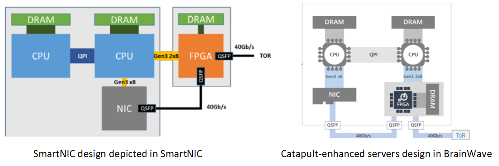
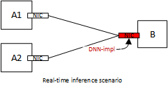
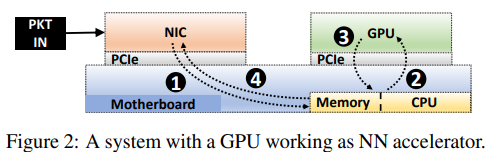
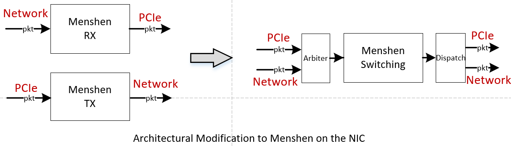
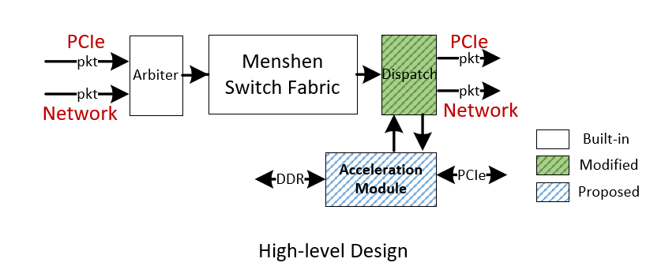

### Design Note

This design together with Menshen is intended for re-constructing the data of the application layer from a number of packets. The ultimate goal is to enable application-acceleration on the NIC. For example, we might want to implement a ML accelerator on the NIC so that the computation can be finished right after network processing units (e.g., a RMT module). Such a design can also be found in the industry community. [SmartNIC](https://www.microsoft.com/en-us/research/uploads/prod/2018/03/Azure_SmartNIC_NSDI_2018.pdf) and [BrainWave](https://www.microsoft.com/en-us/research/uploads/prod/2018/06/ISCA18-Brainwave-CameraReady.pdf) in Microsoft Azure share the same FPGA board for both network processing and DNN acceleration. 

There are a couple of **requirements** to make the design work in the scenario of Data Centers:

> I'm not sure what is missing in the requirements, so I just put the points which are already in my mind here.

1. data shall be re-constructed based on the abstraction of **flows** (the definition of **flow** can be as simple as 5-tuple group). Generally, a server in the data center runs multiple processes belonging to different tenants/applications. Thus, the NIC shall be able to isolate those data when there are multiple acceleration cores/pipelines on board.
2. DDR should be virtualized to enable simultaneous memory-access operations. Again, running multiple acceleration core on the NIC means pushing different data to DDR possibly. And this operation shall also be isolated to avoid disturbance in between.
3. the design shall be able to generate packets (given flow info in advance) **both on the RX/TX path**. Specifically, packet generation on the RX path allows acceleration core return computation results to the main process on the CPU side. packet generation on the TX path allows a complete bypass of the CPU in the distributed application acceleration scenario (a similar case can be found in [hyperloop](https://dl.acm.org/doi/pdf/10.1145/3230543.3230572)). 

#### Relation with Menshen

**Data Path:** Because the design is intended for data re-construction of the application layer, it is reasonable place the re-construction module after the network processing module (which in our case is Menshen).

> **Side Note:** What is the relation between the project SmartNIC and BrainWave? Well, after comparing the two design, I'm pretty much convinced that they are actually deployed on the same board. **So the question for me becomes: What is the problem that our design is trying to solve?**

**Compiler:** It shall be noted that instead of reuse Menshen's p4 compiler, the logic in the application acceleration most likely will have its independent compile workflow. 

**Runtime: ** the 2 modules are mostly independent except that: 1) certain rules shall be installed in Menshen to ensure different flows are received/processed by the correct data re-construct module. 2) There shall be a dispatching module between the two for scheduling tasks (namely pushing the traffic to the correct application-acceleration core or vice versa).

**Placement:** It is reasonable to **isolate** Menshen pipeline with the application acceleration regions on board. Menshen being a RMT-like design is able to perform runtime reconfiguration with the help of P4 abstraction. On the other hand, the application acceleration unit may have several ways for reconfiguration: 1) switch off/on a specific module that is already on the FPGA; 2) using partial reconfiguration to download the specific bitstream on the FPGA; 3) a high level abstraction (similar to P4/RMT) that allows runtime reconfiguration.  

#### Use-cases and Data-flow demonstrations

##### 1. NIC-accelerated real-time inference system 

> We choose this scenario because: FPGA is proved to be a perfect platform for real-time inference system for its high parallelization without batching.

Server As and server B are interconnected on the cloud. And a trained DNN-based inference system is implemented on Server B's NIC. Server As send inference requests randomly to B. 

Before the NIC can be leveraged as an inference system, the request shall be received by the CPU via NIC. After that, the vector contained in the request is extracted and feed into the accelerator (maybe a GPU or FPGA standalone accelerator). The result of the accelerator returns back to the main memory. And then the CPU will issue a response message to the sender (server As). The figure from [N3IC](https://arxiv.org/pdf/2009.02353.pdf) demonstrated the whole process similarly:

After the inference system is implemented on the same FPGA with NIC, the whole process becomes much simpler (and faster).

1. Firstly server B can use whatever ways (e.g., partial reconfiguration) to offload the inference system on the NIC.
2. Server B should also install a rule on Menshen, which include the serving ip_addr, ports, etc. of the inference application. So that the NIC knows when to send data to the acceleration core on the NIC.
3. Server As send requests without knowing the inference system is offloaded on the NIC.
4. Server B's NIC receives the request and response to the sender after the result is calculated. 

**Problem:** Microsoft's Brainwave has such a similar design the avoids CPU involvement with pure FPGA accelerator clusters.

#### Hardware Architecture

##### 1. Simplifications

1. Currently, the design doesn't take stateful protocols (TCP, QUIC, etc.) into account. 

   >  A full-offloading of TCP state machine has been proofed extremely time and resource-consuming on FPGA. On the other hand, a large portion of traffic inside DC is UDP-based, which makes the simplification reasonable.

2. Data belonging to different applications doesn't appear in the same packet.

   > This simplification avoids the design to split packet payload, which is a performance-killing operation on the hardware (will require many bit shift ops). And this is also reasonable since traffic of different application shall have different 5-tuple group, which we will use as the way of identifying traffic.

3. DRAM access from Menshen and application acceleration units are physically isolated (use different pins/DDR).

   > It avoids potential complex DDR access control thus we can focusing on the DDR virtualization only for application acceleration units. ***sidenote: there should be a bunch of research discussing how this can be done. Thus, I'm afraid this part would be more of an engineering implementation.*** 

##### 2. Overall Architecture

First of all, we need a architectural "fix" in the NIC to change the way how Menshen is inserted (as shown in the figure below). Traditional NIC has separated TX and RX paths. However, a switching fabric is needed to perform virtual switch operations in modern data centers. With such a modification to the NIC, a single Menshen module will be able to fully operate the packets from both directions, thus avoiding putting two identical Menshen both on the TX and RX path (resource waste). 

As depicted in the figure below, Acceleration module is attached to Dispatch. 

Dispatch module is responsible of dispatching packet based on metadata attached on the packet. For example, if the packet is a request message to Acceleration Module, a specific rule will be matched in Menshen Switch Fabric and the destination (namely a specific acceleration core on the NIC) will be written to the metadata. Dispatch module checked the destination and dispatch the packet to Acceleration Module accordingly.

Acceleration Module is responsible for application acceleration and is the core module in this design. Beside data from the network (UDP/IP or RDMA), Acceleration Module also has access to extern DRAM via DDR and main memory via PCIe/DMA.

#### Software Design

**Note:**

1. different application may use different protocols to convey data. A general module to extract payload out of packets may not be preferred.
2. is it reasonable that RX/TX path are merged with an arbiter and using a switching module to direct the RX/TX traffic. 

 

