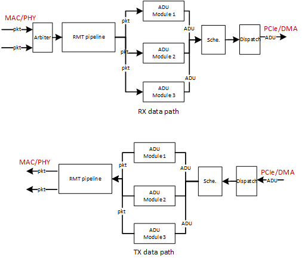
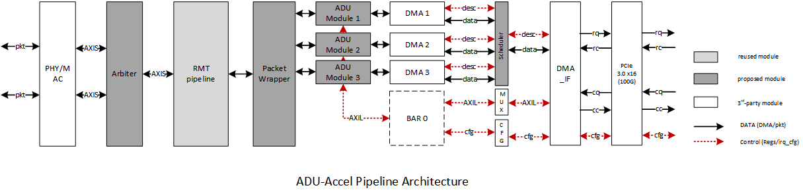
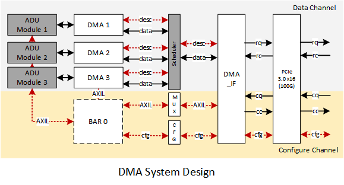
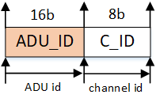
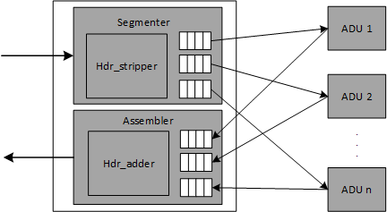
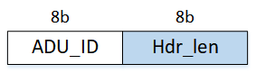
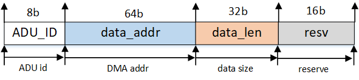

## Design Note 

As pointed out by Google in 2015, 22%-27% CPU cycles in its data centers are spent in presentation layer operations [3] (compression/decompression, rpc, etc.). As a result, offloading the presentation layer onto programmable NICs is a promising way to save CPU cycles for applications.

> This requires re-design to both API (to replace socket) and the NIC.

The architecture should be an End-to-End design:

1. application pushes ADU (i.e. DMA address of the ADU) to the NIC;

   1. the length of ADU is a tradeoff. (video chunks, text message, image, file)

      > I need also consider that the memory on the NIC is limited.

   2. the sender side should provide location info of ADUs in case ADUs arrived out-of-order on the receiver side.

      > or at least the sender and receiver should have high-level agreement on where/when the ADU should be put.

2. NIC is responsible for the ADU <--> packet conversion and visa verse.

**The ADU-packet conversions must be driven by application knowledge.**

**ADU should take the place of packet for manipulation:**

* can be processed out of order;
* can be mapped onto memory (user space) separately;
* smallest unit for error recovery.


> 2 types of ADU delivery between NIC & memory:
>
> 1. push the data to memory blocks successively (file transfer);
> 2. copy the data into separate places (as results/parameters of program, RPC.) **hard to achieve.**

### Motivation with real-world demos

Two experiments showing the proportion of CPU cycles on the ADU generation (pre-processing). And using perf to obtain the `L3 cache missing rate` and `CPU cycles` spent on data manipulating operations.

1. Data Vectorization for NLP processing; 
   1. skip spaces and emojis from the text;
   2. convert the words to one-hot vectors using dictionary;
   3.  push the vectors into GRU (matrix multiply) and obtain the final vector.
2. word aligned copy from R2000 integer to ASN.1;
   1.  aligned copy to ASN.1 and word aligned.

### Expected Performance Bottlenecks

	1. manipulations to the data (conversion, compress, encryption);
	2. random memory access (JAVA objection serialization, file transfer)

### ADU abstraction

As suggested in [1], the definition of ADU (contents, length) is based on application knowledge. There are several types of application that cover most of the services that servers provide in the cloud.

**application type to support: **e.g., key-value stores,data analytics, machine learning training, web crawling, and scientific computing. 

| Type         | Data Unit   | Size         | Demo                      | Formats        | TX ops                 | RX ops                                   | IP  cores                          |
| ------------ | ----------- | ------------ | ------------------------- | -------------- | ---------------------- | ---------------------------------------- | ---------------------------------- |
| large file   | file        | random       | sftp                      | ASCII/EBCDIC   | encryption/compression | decryption/decompression                 | https://github.com/linuxbest/lzs   |
| text (NLP)   | sentence    | <1KB         | data-vectorization        | ASCII          | none                   | vectorization (lookup, matrix multiply.) | https://github.com/mkearney/wactor |
| image        | image       | (500B, 20MB) | face-detection            | JPEG, PNG, GIF | compression            | decompression, binarization              | vivado  built-in                   |
| video        | video chunk | (5MB, 50MB)  | MPEG-DASH                 | 264            | H264 encoding          | H264 decoding                            | vivado  built-in                   |
| JAVA objects | objects     | <128MB       | Cereal[2] / JAVA bulit-in | byte sequence  | serialization          | deserialization                          |                                    |
| undefined    |             |              |                           |                |                        |                                          |                                    |

According to the table above, the size of ADU should range from several types to several hundreds of MB. 

**E2E Data Execution Path**: For each application:

1. on the sender side, the CPU should push the descriptor which points to the physical address of the data (can be DMAed) to the NIC together with the metadata (ADU_ID, ADU length);
2. The specific ADU-module pulls the ADU from DMA and execute the TX ops (encryption, compress, serialization, etc.);
3. ADUs are converted into packets and transferred in the network
4. On the receiver side, the RX ops (decryption, vectorization, decompression) that a specific ADU-module should execute are registered right after the application started up;
5. After the the packet is dispatched from RMT pipeline, the ADU-module obtains packets and re-construct the ADU. Then execute the operations registered before.

### Hardware Design



#### Pipeline Design



The overall design is shown as the figure above. The left side is connected with network interfaces (qsfp28 ports) while the right side is connected with the host using PCIe (PCIe3.0 x16).  

##### 1. DMA design



The multi-queue DMA in the design is adopted from the DMA engine in [corundum](https://github.com/Winters123/verilog-pcie) as it can be extended to support high-speed multi-channels for ADU modules.

The DMA system can be divided into **Data Channel** (RQ & RC) and **Configure Channel** (CQ & CC). Data Channel is responsible for ADU transferring between NIC and the host memory, while configure channel is used to expose the BAR0 configuration space to the host.

**The scheduler** is responsible for scheduling ADUs across applications on the software and ADU modules on the hardware. For the TX path, which ADU module that a block of data feed into is directed by the scheduler. Thus, a **redirect table** is implemented inside. The format of the table entry should be like: |  APP_ID  |  ADU_ID   |. Considering the ADU is tightly coupled with a specific application on the software, its reasonable that we use **16b L4 port ID** as the **APP_ID **. And the **8b ADU_ID** is the **sequence number of  a specific ADU module** on the NIC. Thus, the scheduler is able to redirect the ADU correctly to the ADU module.



For the RX path, the data path is decided by the RMT pipeline. We use p4 to control the data path of the ADU coming from the network. Same as the TX path, there is also a **redirect table** (implemented in RMT pipeline), which entry has two similar fields: | APP_ID  |  ADU_ID |. The **16b APP_ID** is actually the **port ID on L4**.

P.S. _The dispatch module will be implemented as the DMA engine on the NIC._

---

On the TX path:

1. After the driver is initialized, the DMA-able buffer space on the memory is waiting to be filled by the application;
2. The application writes ADU to the buffer space. Once its done, the CPU writes the descriptor to BAR 0 exposed by PCIe configure channel (CQ interface);
3. The MUX module (middle of the figure) directs the descriptor to the correct DMA module according to the `ADU_ID` carried in it;
4. the DMA module issues a DMA read according to the descriptor and push the ADU data to the ADU module for further process. 

On the RX path:

1. After the ADU are extracted/processed by the ADU module, it is pushed to the FIFO that DMA module maintains;
2. The DMA module obtains a descriptor from the desc-queue and issues a DMA write;
3. The write request is converted to a write transaction on the RQ interface and sent to the memory;
4. The memory tells the DMA module when the transaction is finished via RC interface.

---

##### 2. Scheduler

Scheduler is connected with ADU modules with the DMA interface using a flexible crossbar (with a simplified switch table). On the TX path, Scheduler is responsible for scheduling ADUs to different ADU modules. On the opposed direction, Scheduler is implemented as a typical **N to 1** scheduler to push ADUs back to the host. 

##### 3. ADU Modules

ADU module is the core functional module on the NIC. Its responsible for executing the presentation layer operations (compression/decompression, etc.).

##### 4. Segmenter & Assembler

Segmenter & Assembler is for the conversion between 'packet' and 'ADU'. On the RX path, it extracts the payload from the packet and reformats the ADU for further processing in the ADU module; On the TX path, it adds packet header to the ADU data and push the packets to the RMT pipeline.



> For ADUs larger than MTU, the ADU may be segmented into several packets according to the size of MTU. For ADUs smaller than the MTU, several ADUs can be assembled to one packet to make the better use of bandwidth. 

On the RX path, the RMT pipeline helps to determine which ADU_ID it belongs to. Thus, the Segmenter only needs to extract the payload out of the packet based on the length of the header. On the TX path, the Assembler also need to add a **fake header** to the ADU based on the length of the header. And the correct header can be attached to it in the RMT pipeline.

A key data structure here is a **mapping table** to attach/detach packet headers to ADUs. The table should contain the mapping relation between **ADU_ID** and **Header_Length**.



On the TX path, Hdr_adder is responsible for add packet headers before ADU (payload). the exact packet header can be retrieved by matching the ADU_ID with a `header adder table`. This table also determines the length of each packet. Thus users can determine the size of the packet regardless of the size of ADU.

##### 5. RMT pipeline

The switch fabric on the NIC. Beside basic switch services, the RMT pipeline can be used to **reformatting packet headers** for each packet on the TX path. For example, the ADU sends out the payload wrapped in a **fake packet header** (using a same length of `EtherHdr`+`IPHdr`+`UDPHdr`, but just contains an internal ADU ID). Then the RMT pipeline is responsible for replacing the ADU index with the correct packet header that the user configured using p4 code.

On the RX path, the RMT pipeline will re-direct the packet to the determined ADU module according to the rules offloaded by the user by his p4 code.


**Descriptor Design**: The descriptor needs to include info such as address, data size, ADU ID, etc. Thus, a simple format we can use for descriptor is:



On the software, for each block of data that needs to be transferred to the NIC, the application process needs to fill the `simple_descrptor` node on the DMA-able space:

```C
struct simple_desc{
	_u8  ADU_ID;
	_u64 data_addr;
	_u32 data_len;
	_u16 resv;
};
```


### Software Design

#### ADU Manager

To work with NIC properly, the software side should also maintain the data path that ADUs from a specific application should go through. **ADU Manager** is responsible for data path configuration in this regard. It works as an independent process. The data path determinations of TX/RX path have different considerations:

For the TX path, which ADU module that a block of data feed into is directed by the scheduler. Thus, the software side should be able to config a **redirect table** (implemented on the NIC) before firing up the application (who has a corresponding ADU module on the NIC). The format of the table entry should be like: |  APP_ID  |  ADU_ID   |. Considering the ADU is tightly coupled with a specific application on the software, its reasonable that we use **16b L4 port ID** as the **APP_ID **. And the **8b ADU_ID** is the **sequence number of  a specific ADU module** on the NIC. Thus, the scheduler is able to redirect the ADU correctly to the ADU module.


For the RX path, the data path is decided by the RMT pipeline. We use p4 to control the data path of the ADU coming from the network. Same as the TX path, there is also a **redirect table** (implemented in RMT pipeline), which entry has two similar fields: | APP_ID  |  ADU_ID |. The **16b APP_ID** is actually the **port ID on L4**.

#### Application [TODO]

[TODO] The application on the software runs exact the same as applications running on conventional servers, except that it doesn't use socket for data send/receive.

#### SW-HW Interface [TODO]

In order to perform the ADU processing correctly on the NIC, certain API/data structures shall be used to config the switch pipeline and ADU modules as needed. For  

The API here is mainly to replace the conventional Socket API. Before the NIC is able to process the ADU, certain instructions should be pushed to the NIC:

1. underlaying packet header info, so that the NIC can wrap up ADUs in packets (take the place of network stack in the kernel);

2. the info needed by the ADU module to process ADUs on the NIC;

   > keys for encryption/decryption, img size for img compression/decompression, dictionary for word vectorization, etc. 

3. other info for ADU-packet conversion (e.g., packet size), scheduling priority, forwarding rules.


### Security Design

isolation between different ADUs/applications.

### Design Considerations

##### 1. How the ADU can be written to DMA-able buffer space? 

OK, things are a little bit tricky. Even with a user-space DMA mechanism, the buffer space still needs to be issued in the kernel and mapped onto user-space. This means that ADUs still need one-copy before it can be DMAed to the NIC. On the RX path, the ADU still needs to be copied out of the buffer space to the user process.

##### 2. How the NIC works with partial reconfiguration?

since the NIC hasn't to be fully implemented using FPGA, partial reconfiguration is only optional here. However, the skeleton of the NIC should be FPGA based, which makes partial reconfiguration possible for a FPGA-based ADU module.

##### 3.How to deal with flexible size of ADUs on the RX path?

### Reference

[1] Architectural Considerations for a New Generation of Protocols.

[2] A Specialized Architecture for Object Serialization with Applications to Big Data Analytics.

[3] Profiling a warehouse-scale computer.


 


